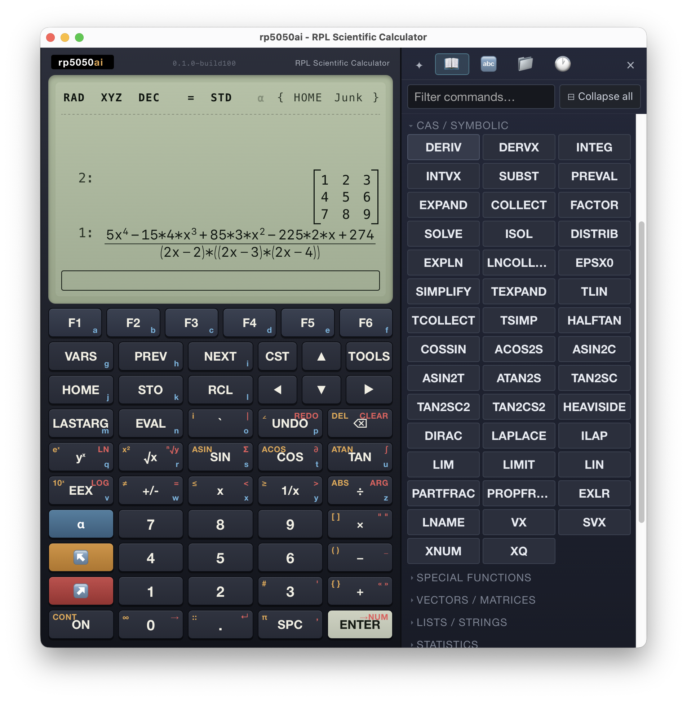
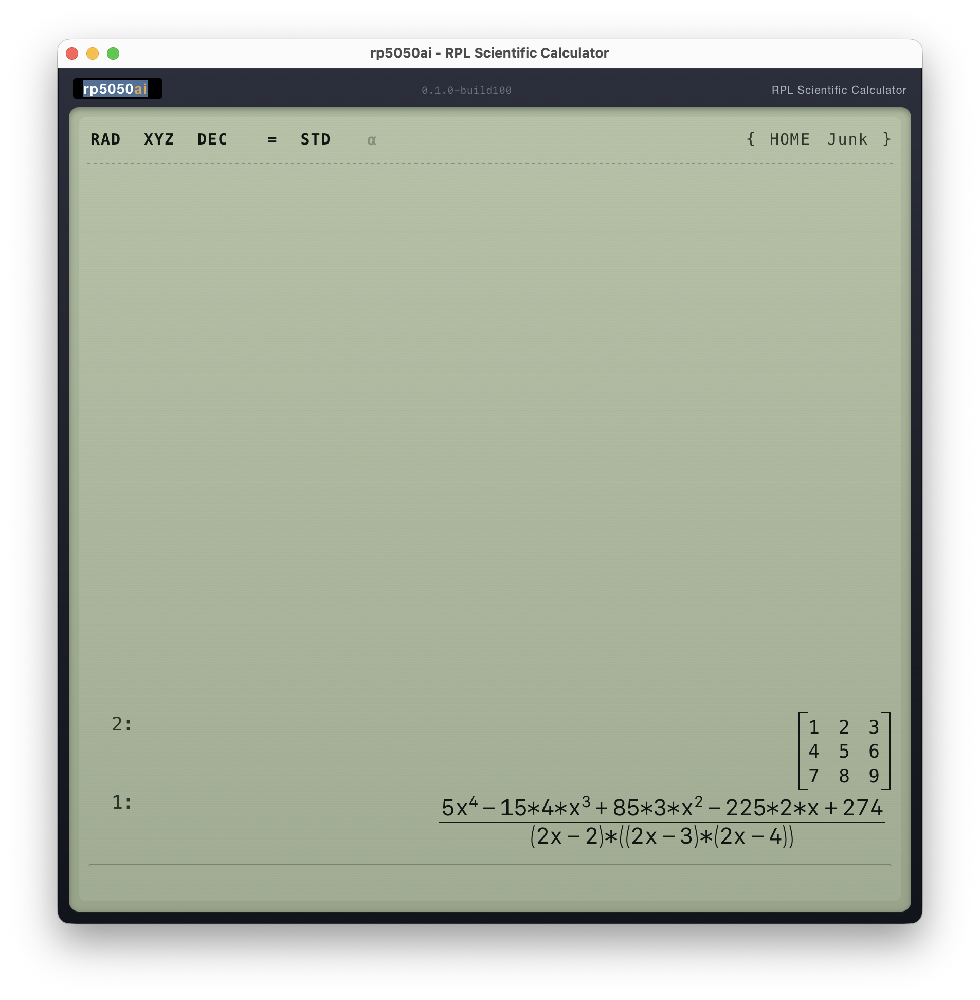
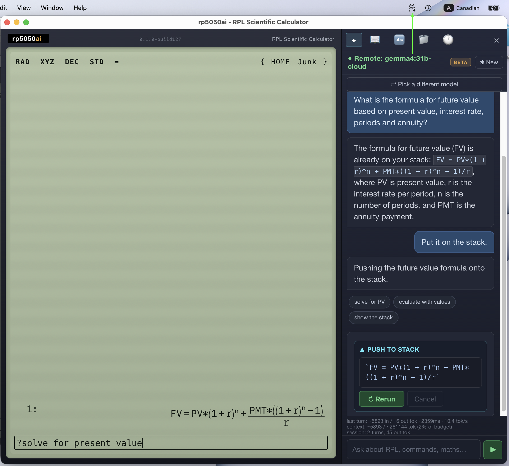
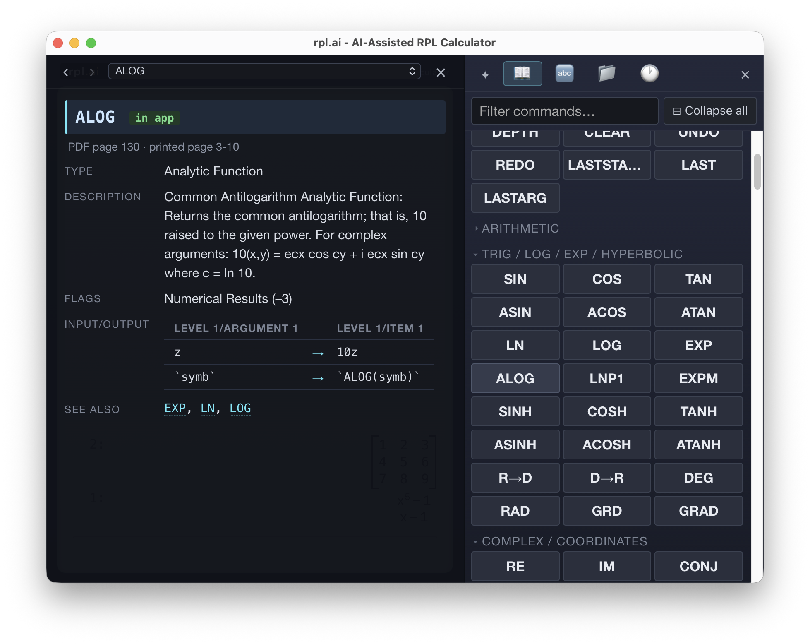
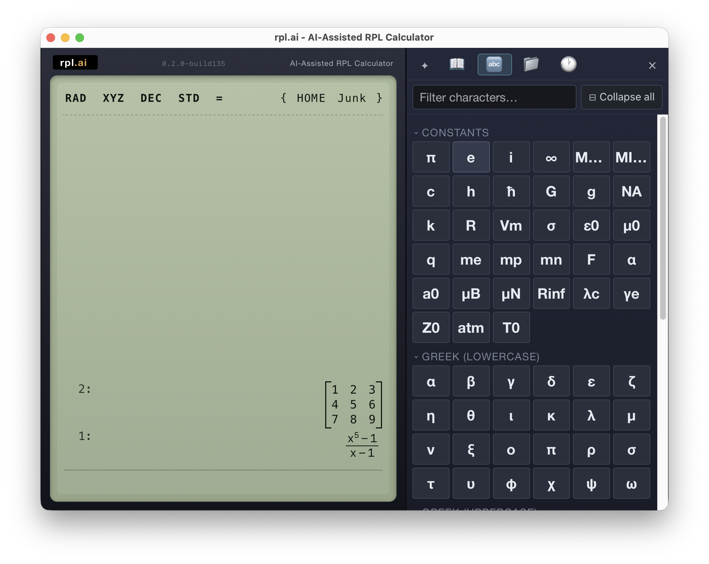
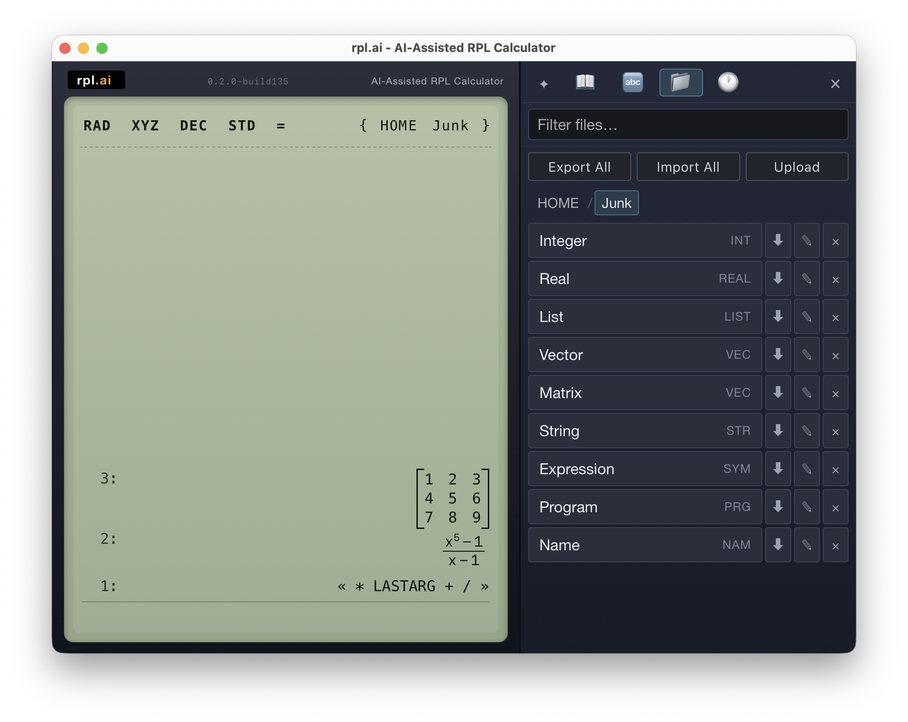
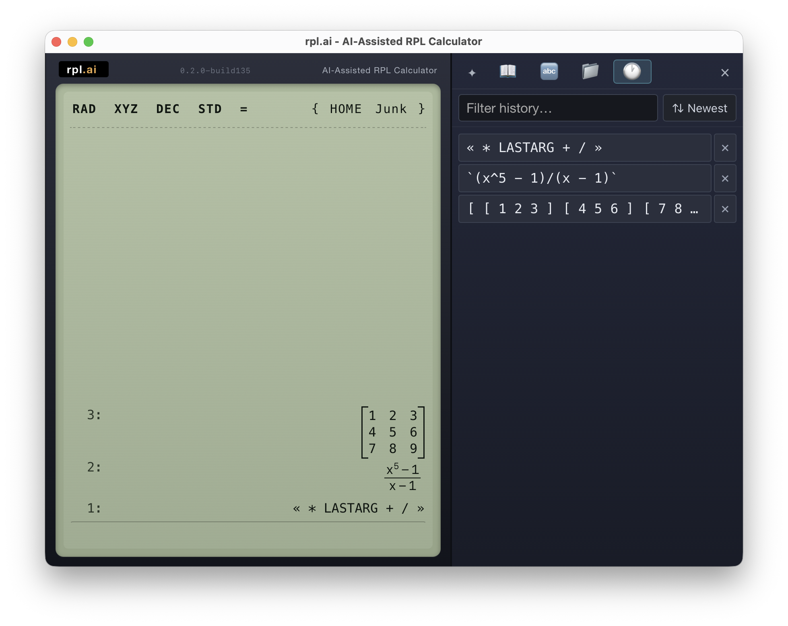

# rpl.ai — AI-Assisted RPL Calculator

| Full View                         | Minimal View (resizable)            |
|:---------------------------------:|:-----------------------------------:|
| 💡Click logo to switch views      | 💡Full keyboard + mouse support       |
|  |  |

| AI Assistant                                                                     |
|:--------------------------------------------------------------------------------:|
| 💡Ask about RPL, derive formulas, and push results straight onto the stack       |
|                                                |

| Commands (with help)                                              | Constants & Characters                                                  |
|:-----------------------------------------------------------------:|:-----------------------------------------------------------------------:|
| Command catalog with inline help (right-click)                    | 💡Physical constants and special-characters                       |
|           |          |

| File Manager                                                      | History                                                                 |
|:-----------------------------------------------------------------:|:-----------------------------------------------------------------------:|
| 💡Browse and organize programs, variables, and data               | 💡Replay any prior session entry straight back to the stack             |
|                       |                                       |

---

## The story

I've always had a soft spot for the HP 48/49/50 series — specifically for
the interface, not the hardware. RPL's postfix, stack-based model feels
remarkably natural once it clicks: you write out your operands first, then
apply the operation, exactly the way you'd work through a calculation by
hand. You jot 24 and 15 on paper, one above the other, then perform the
multiplication to get 360. The stack makes that workflow explicit and direct.

What really distinguished RPL, though, was the seamless consistency between
built-in commands and user-defined ones. You could write a program, store it
under a name — say `II` for the parallel-resistance operator — and invoke it
exactly the same way you'd invoke any built-in: press the soft key beneath
its name, call it from the command line, or assign it to a key. There was no
second-class "user program mode." Everything lived in the same namespace and
behaved the same way.

The hardware was a different story. In raw specs it trailed TI's flagships —
the TI-89 and TI-92 — and HP's long reluctance to move off the Saturn CPU
kept the platform in an increasingly awkward position. The interface was
clearly the better one; the silicon holding it back was a persistent
frustration. HP's eventual decision to run Saturn emulation on an ARM core
for the HP 50g was a clever move — it kept the existing software ecosystem
intact — but it was also a missed opportunity. A native ARM implementation
could have unlocked dramatically more speed and left headroom to address the
screen resolution and other lingering limitations.

I kept an HP 50g within reach for years, and when that became impractical I
turned to emulators. The iOS and Android emulators are genuinely well-crafted
— I've used several and still use them. But phone screens are close to the
size of the original device, so the scaled-up 128×80 display doesn't feel
like much of an improvement. And while I tried many other RPN/RPL calculator
apps over the years, nearly all of them implement some minimal form of RPN
with a limited stack and no display to speak of — and essentially none are
programmable, let alone anything approaching the HP 50g's programming model.
The RPL interface is simply the best of the lot, regardless of what anyone
else says.

On the desktop the situation was trickier. I ran emu48+ on Windows and, at
various points, on macOS via PlayOnMac and even Parallels — and it worked,
which was great. But I kept wishing for more: higher resolution, full
keyboard-and-mouse support, multiple undo levels, a file manager that made
it easy to move programs and data in and out.

When the HP Prime arrived I was hopeful. Higher resolution, yes — but not by
much. Better keyboard integration on the Android version, maybe, but nothing
useful on Windows or macOS without an Android emulation layer. And, most
disappointingly, it discarded enough of the original HP 48/49/50 interface
to feel like a different calculator entirely while giving back very little in
return. It felt like a step sideways at best.

I looked around for alternatives. Surely I wasn't the only one who wanted
this. I never found anything close to what I had in mind, so I eventually
shelved the idea — though it lingered. I had tried to build something like it
a couple of times before, but the scope always made it feel like years of
work.

Then things changed. AI-assisted development made what had previously felt
intractable feel tractable. So I gave it a serious try, and **rpl.ai** is
what came out of that effort.

---

## What it is

rpl.ai is a desktop RPL scientific calculator built for high-resolution
screens, full keyboard-and-mouse input, and a comfortable side panel. It
faithfully implements the HP 50g's User-RPL language and command surface, and
replaces the original 128×80 LCD and aging CAS with a modern UI backed by
[Giac](https://www-fourier.univ-grenoble-alpes.fr/~parisse/giac.html) —
the computer algebra system written by Bernard Parisse, who also authored
"erable," the CAS that shipped on the HP 48GX/49/50g. Giac is, in a real
sense, the natural heir to the original engine.

The side panel (visible in the full-view screenshot above) hosts the command
catalog, character picker, file explorer, and session history. It's very much
in the spirit of the HP-28's side panel — the original gangster of that
design — and it's where future features like graphing, the equation writer,
and the matrix editor will live, rather than as inline calculator prompts.

The app runs as a native desktop window via [Tauri 2](https://tauri.app/) on
macOS, Windows, and Linux. The entire frontend is plain HTML / CSS / ES
modules — no build step, no framework.

**Current status:** The stack engine, RPL parser/evaluator, structured
control flow (`IF` / `WHILE` / `DO` / `FOR` / `START` / `CASE` / `IFERR`),
compiled local variable environments (`→ a b « … »`), and the
suspended-execution substrate (`HALT` / `CONT` / `KILL`) are all working.
Most of the HP 50g command set is registered. See
[docs/ROADMAP.md](docs/ROADMAP.md) for what's remaining and
[docs/COMMANDS.md](docs/COMMANDS.md) for the current command inventory.

**Not yet implemented:** graphing (Desmos integration is planned), equation
writer, and matrix writer. These are on the roadmap and will surface in the
side panel.

---

## Design philosophy

The guiding principle is **functionality over compatibility**. Where a side
panel interaction is cleaner than replicating an original calculator prompt,
the side panel wins.

The following are explicitly out of scope and will not be implemented:

- Saturn assembly or System RPL
- HP calculator accessories, IR/serial communication, or any hardware
  interface
- Library and port management (no library support at all)

---

## Acknowledgements

I may be the only person in the world who wanted exactly this application.
AI was the last mile, but it would not have been possible without the
contributions of many people in the open-source community. This project
bundles or depends on:

- **[Giac](https://www-fourier.univ-grenoble-alpes.fr/~parisse/giac.html)**
  (GPL-3.0+) — Bernard Parisse's computer algebra system, prebuilt as a
  WebAssembly module via
  [emgiac](https://github.com/adriweb/emgiac)
- **[decimal.js](https://github.com/MikeMcl/decimal.js)** (MIT) — arbitrary-
  precision decimal arithmetic, giving HP-style BCD behaviour for numeric
  operations
- **[fraction.js](https://github.com/rawify/Fraction.js)** (MIT) — exact
  rational arithmetic
- **[complex.js](https://github.com/rawify/Complex.js)** (MIT) — complex
  number arithmetic
- **[MathLive](https://cortexjs.io/mathlive/)** (Apache-2.0) — math input
  and rendering components
- **[CodeMirror 6](https://codemirror.net/)** (MIT) — the RPL source editor
- **[KaTeX](https://katex.org/)** (MIT) — LaTeX math rendering for the stack
  display *(to be integrated)*
- **GMP / MPFR / MPFI** (LGPL) — arbitrary-precision arithmetic libraries
  compiled transitively into Giac's WebAssembly

See [NOTICE](NOTICE) for full attribution and upstream pointers.

---

## Getting started

```bash
# one-time setup
npm install
rustc --version   # Tauri requires a Rust toolchain — install via rustup if missing

# run in a native Tauri window (hot reload + DevTools)
npm run dev

# produce a platform installer
npm run build
```

Build output lands in `src-tauri/target/release/bundle/` — `.dmg` on macOS,
`.msi` on Windows, `.deb` / `.AppImage` on Linux. For a detailed walk-through
including common Tauri v1→v2 pitfalls, see
[TAURI_QUICK_START.md](TAURI_QUICK_START.md) and
[TAURI_SETUP.md](TAURI_SETUP.md).

The frontend is pure static assets. You can also open
[www/index.html](www/index.html) directly in a browser to use the calculator
without Tauri, with the caveat that features depending on Tauri APIs (native
menus, filesystem persistence) won't be wired up.

---

## Try this first

If RPL is new (or rusty), here's a short tour that exercises most of what
the calculator can do in a few minutes.

**Stack arithmetic.** Type `24` ENTER, then `15` ENTER, then `*`. The two
operands stack up; `*` consumes them and leaves `360`. Whitespace-separated
input works too — `2 3 + 4 *` evaluates left-to-right and ends with `20` on
the stack.

**Symbolic algebra.** Push `'X^2-4'` and run `FACTOR` → `(X-2)*(X+2)`. Try
`'SIN(X)' 'X' ∂` for a derivative, or `'X^2-4=0' 'X' SOLVE`. The CAS is
Giac, so most expressions you'd type into Xcas work here too.

**Local variables.** `2 3 → a b « a b + a b * »` pops two values into named
locals, runs the body, and tears down the frame on exit. Compiled locals are
the normal way to give intermediate values names inside a program.

**Store a program.** Type `« DUP * » 'SQ' STO`. Now `5 SQ` gives `25`. User-
defined names sit in the same namespace as built-ins — same lookup, same
EVAL, same right-click help.

**The side panel.** Open the catalog and type to filter the command list;
right-click any entry for its signature and description. The characters
panel handles Greek letters and operators that aren't on the keyboard. The
file manager moves programs and variables in and out of the calculator's
home directory.

**Ask the AI.** Prefix any command-line input with `?` to send it to the
assistant — e.g. `? give me a program that returns the n-th Fibonacci
number`. Answers come back as RPL you can push onto the stack with one
click.

**History.** Every entry from the current session is replayable from the
history panel — click a prior result to push it back onto the stack.

---

## Project layout

```
www/                  Browser-loaded assets (Tauri frontendDist)
  index.html          Calculator shell
  src/app.js          Bootstrap
  src/rpl/            Stack engine, parser, evaluator, formatter, persistence
  src/rpl/cas/        Giac adapter (synchronous, main-thread) + AST↔Giac conversion
  src/ui/             Keyboard, display, interactive stack, side panel, entry
  src/vendor/         Vendored third-party libraries (giac, decimal.js, etc.)
  css/                Styles
src-tauri/            Rust/Tauri host (window config, icons, native glue)
tests/                Node-based test suites
docs/                 Reference notes, HP 50g documentation, roadmap
```

---

## Testing

Tests are plain Node ES modules under [tests/](tests/) — no framework:

```bash
node tests/test-all.mjs          # full suite
node tests/test-algebra.mjs      # single file
node tests/flake-scan.mjs        # repeat runs to surface order-sensitivity
```

Each `test-*.mjs` file covers one area (parser, evaluator, stack ops,
numerics, matrix, units, stats, persistence, reflection, UI, …). The harness
exits non-zero on the first failure and prints a diff.

---

## Documentation

- [docs/RPL.md](docs/RPL.md) — RPL language support: parser, evaluator,
  control flow, local environments, suspended execution
- [docs/COMMANDS.md](docs/COMMANDS.md) — HP 50g command surface and coverage
- [docs/DATA_TYPES.md](docs/DATA_TYPES.md) — stack value types and widening rules
- [docs/TESTS.md](docs/TESTS.md) — test harness conventions
- [docs/ROADMAP.md](docs/ROADMAP.md) — next-feature map

---

## License

rpl.ai is licensed under the **GNU General Public License v3.0 or later**
(`SPDX-License-Identifier: GPL-3.0-or-later`). See [LICENSE](LICENSE) for
the full text.

Because Giac is GPL-3.0+, the combined work must be distributed under
GPL-3.0-or-later. You may not relicense this project under a more permissive
license while Giac remains bundled.

*HP, HP 48, HP 49, HP 50g, and HP Prime are trademarks of HP Inc. This
project is an independent reimplementation and is not affiliated with or
endorsed by HP.*
